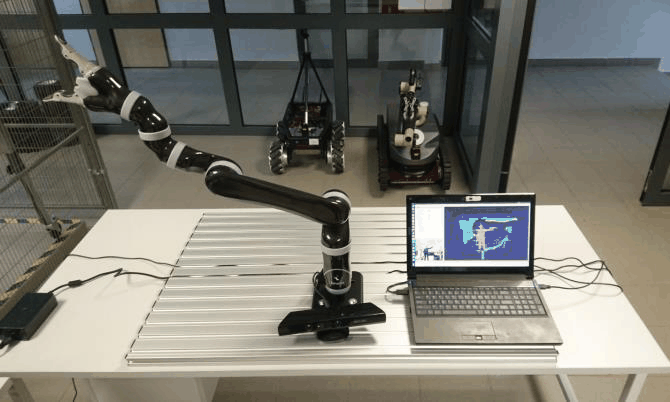

# vision_sorting_robot
Designed an Industry 4.0-ready robotic sorting system using Kinova JACO2 arm and colour-based vision. Built with ROS, Gazebo, and MoveIt, the system sorts items autonomously and logs data to spreadsheets via Iot for real-time monitoring and notifications.

# 🧠 Vision-Based Sorting System Using Robotic Manipulator for Industry 4.0

An autonomous robotic system built with ROS, vision tracking, and Iot to sort colour-coded packages using a 6 Dof Kinova JACO2 robotic arm. This project integrates real-time motion planning, visual object detection, and cloud-based activity logging to showcase a practical Industry 4.0 use case.

📄 [View Full Report](docs/REPORT.pdf)

---

## 📷 System Architecture


---

## ⚙️ Project Setup

- **Robotic Arm**: Kinova JACO2 (6 DoF)
- **Simulation**: Gazebo + MoveIt
- **Vision**: USB camera + blob detection
- **IoT**: Google Apps Script + Google Spreadsheet + AJAX Dashboard
- **Collision Avoidance**: FCL in MoveIt
- **Languages**: C++, Python

---

## 🎥 System Demo



---

## 🧩 SolidWorks Mount Design


---

## 📦 Key Features

✅ Detect and sort boxes by colour (Red, Yellow, Blue)  
✅ Real-time Cartesian path execution with inverse kinematics  
✅ Collision avoidance using MoveIt planning scene  
✅ Logs each sort operation into a spreadsheet  
✅ Auto-emails user summary reports  
✅ Designed with modularity and scalability for warehouse automation

---

## 🧠 Learnings

- SLAM and coordinate transformation between frames
- Inverse kinematics using TRACK-IK solver
- Real-time motion planning in Gazebo + MoveIt
- IoT integration with cloud scripting
- Visual processing using color signature detection

---

## 📂 Folder Structure

```bash
vision-sorting-robot/
├── docs/
│   ├── REPORT.pdf
│   └── images/
│       ├── architecture.png
│       ├── camera_mount.png
│       ├── system_setup.png
│       ├── solidworks_model.png
│       └── system-demo.gif
├── src/
├── launch/
├── urdf/
├── scripts/
├── README.md
